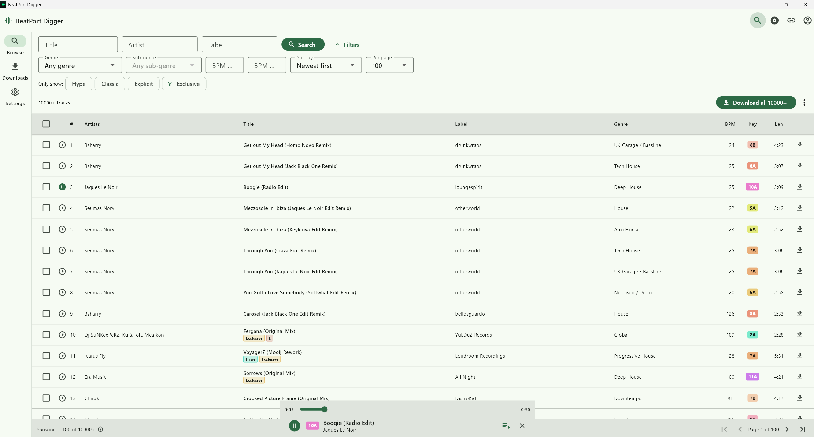
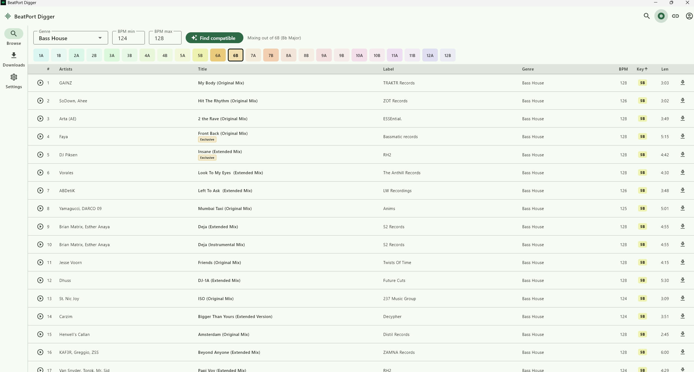
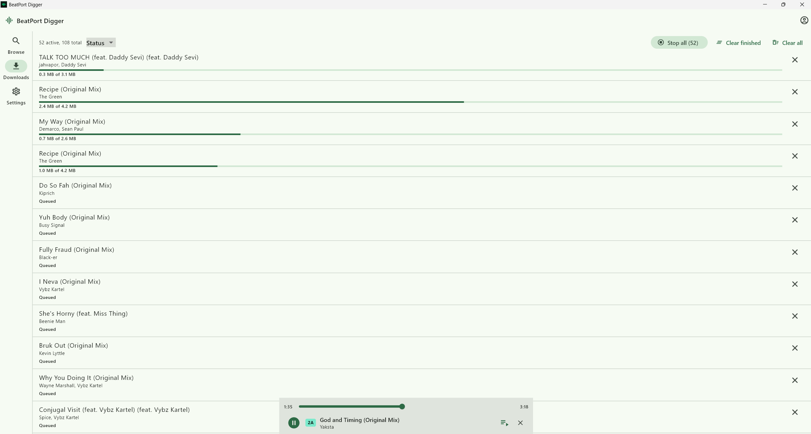
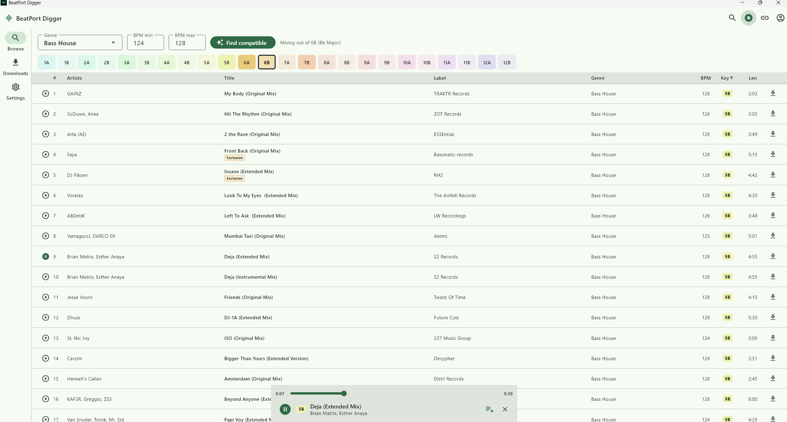
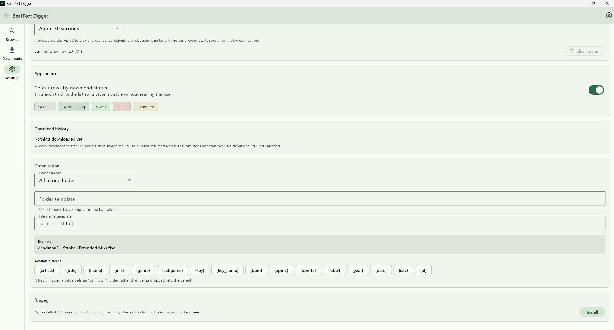

# BeatPort Digger

[](https://github.com/r00tmebaby/BeatPort-Digger/actions/workflows/ci.yml) [](https://github.com/r00tmebaby/BeatPort-Digger/actions/workflows/release.yml) [](https://github.com/r00tmebaby/BeatPort-Digger/releases/latest) [](https://github.com/r00tmebaby/BeatPort-Digger/releases) [](LICENSE)

BeatPort Digger is a cross-platform client for the Beatport catalogue. It signs
in with a Beatport account, searches the catalogue, plays track previews and
downloads available tracks with configurable audio quality and file naming.
It is built with Flutter and runs on Windows, Linux, macOS, Android and iOS
from a single Dart codebase. A browser version, served by a small Dart backend
that reuses the same engine, covers devices without a native build.

## Screenshots

Browse the catalogue with search, filters and sortable columns:



Harmonic browsing on the Camelot wheel and the download queue:

| Harmonic wheel | Downloads |
| --- | --- |
|  |  |

The built-in preview player and the settings screen:

| Preview player | Settings |
| --- | --- |
|  |  |

## Features

- Sign-in with a Beatport username and password. Only the resulting OAuth
  token is cached, never the password. On desktop and mobile the token is kept
  in the platform keychain via `flutter_secure_storage`.
- Search by track, artist, label, genre, sub-genre, BPM and release date range.
- Harmonic browsing with a Camelot key wheel for building harmonically
  compatible selections.
- Link import: paste a Beatport URL (track, release, chart or library) and get
  it back as a track list.
- Preview playback of track snippets, powered by `media_kit`, with autoplay
  and a seek bar.
- Download queue with configurable parallelism, selectable audio quality and
  templated folder and file naming.
- Download history with status colouring, so already exported tracks are easy
  to spot and batches can resume across sessions.
- Web version for phones and tablets on the same network, no install needed.

## Downloads

Every [release](https://github.com/r00tmebaby/BeatPort-Digger/releases) carries
prebuilt artifacts for all supported platforms, produced by the
[release workflow](.github/workflows/release.yml):

| Platform | Artifact | Notes |
| --- | --- | --- |
| Windows | `*-windows-x64.zip` | Unzip and run `BeatPortDigger.exe`. |
| Linux | `*-linux-x64.tar.gz` | Untar and run `beatport_digger`. |
| macOS | `*-macos-universal.zip` | The bundle is unsigned. Clear quarantine once with `xattr -cr "BeatPort Digger.app"`. |
| Android | `*-android.apk` | Allow installs from unknown sources, then open the APK. |
| iOS | `*-ios-unsigned.ipa` | Unsigned. Sideload with AltStore or Sideloadly, or build signed as described in [BUILD-iOS.md](BUILD-iOS.md). |
| Web | `*-web-<os>.zip` | Self-contained local web version. Run the bundled server and open the printed address in any browser on your network. |

## Requirements

- Flutter 3.41 or newer (Dart 3.11+) to build from source.
- A valid Beatport account to sign in.
- Platform toolchains as required by Flutter for the target you build, for
  example Visual Studio with the C++ workload for Windows desktop.

## Run from source

```bash
flutter pub get
flutter run -d windows   # or: linux, macos, or a connected device
```

To run the web version from source:

```bash
cd web/frontend && npm install && npm run build && cd ../..
dart run bin/server.dart
```

The server prints the machine's LAN addresses at startup. Open one of them in
a browser on any device on the same network. See [web/README.md](web/README.md)
for details.

## Build a release

Pushing a tag such as `v1.2.0` builds all platform artifacts on GitHub Actions
and attaches them to the release automatically. Bump `version` in
`pubspec.yaml` before tagging. Local builds work as usual:

```bash
flutter build windows --release   # or: apk, linux, macos, ios
```

The packaged Windows application is written to
`build/windows/x64/runner/Release/` and started with `BeatPortDigger.exe`.

## Testing

```bash
flutter test                              # offline unit tests
flutter test --tags live --run-skipped    # also run the live Beatport suite
```

Tests tagged `live` reach the real Beatport API and are skipped by default,
see `dart_test.yaml`. Running them needs credentials in `BEATPORT_USERNAME`
and `BEATPORT_PASSWORD`, and `BPCAT_CREDENTIALS` for the download suite.

## Project layout

```
lib/
  engine/    Catalogue client, authentication, tokens, HLS handling, downloads
  state/     App state (session, download queue, preview player) via provider
  ui/        Screens and widgets (browse, downloads, settings, harmonic, login)
  main.dart  App entry point and theme
bin/server.dart  Web backend serving the engine over REST for the browser UI
web/frontend/    React front-end for the web version
test/            Unit and integration tests for the engine and UI
android/ ios/ linux/ macos/ windows/   Platform runners
```

## Configuration

Audio quality, download parallelism, download location, preview length and the
folder and file naming templates are all configured from the in-app Settings
screen. Settings and download history persist between runs.

## License

BeatPort Digger is released under the GNU General Public License v3.0, see
[LICENSE](LICENSE).

## Notes

This project is for personal use with a legitimate Beatport account and is
subject to Beatport's terms of service. It is not affiliated with or endorsed
by Beatport.
